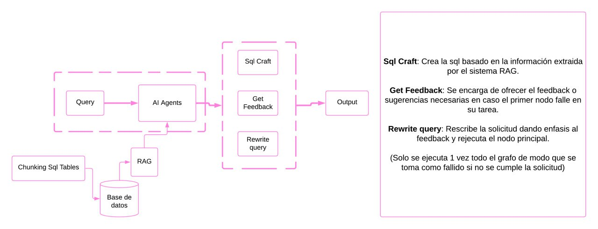
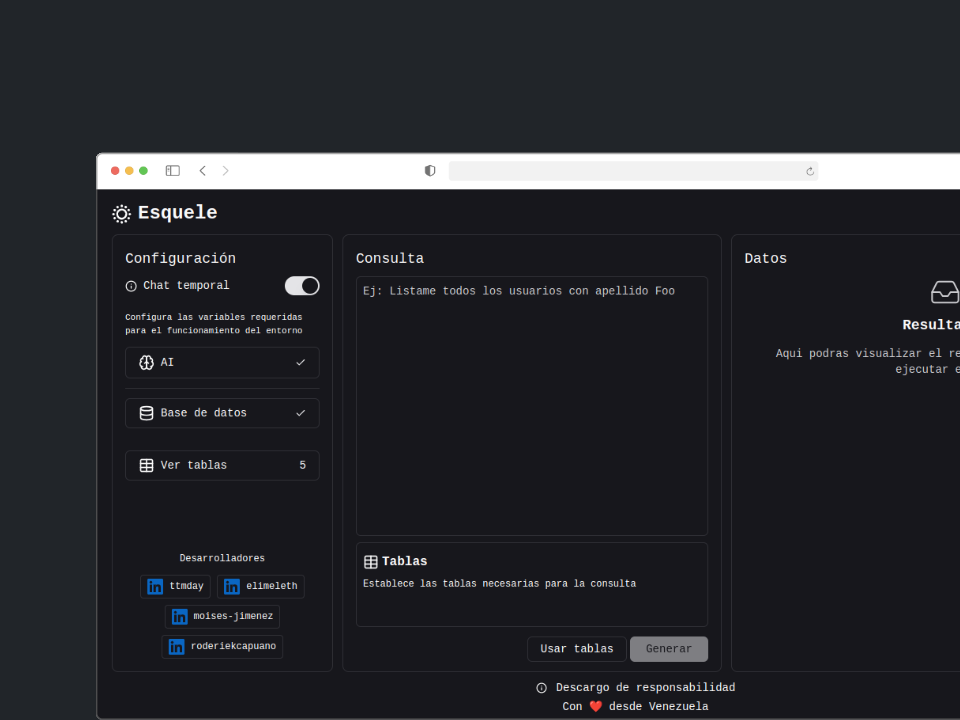
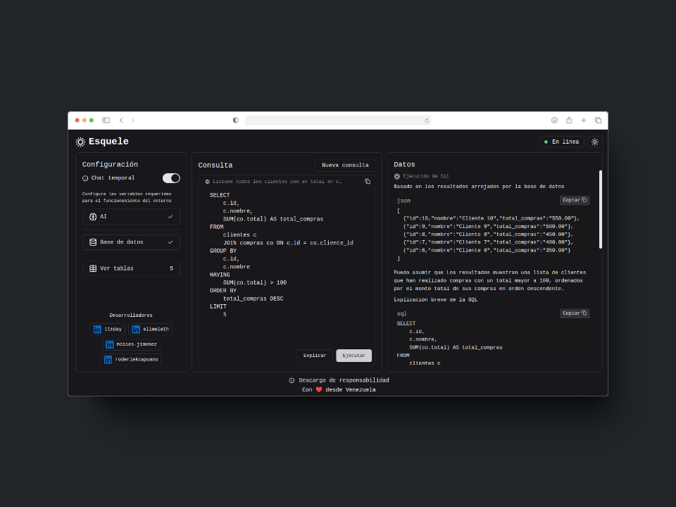

# esquele

### Un sistema simple para interactuar con tus datos

__Correr el sistema en tu local__

```shell
docker-compose up -d --force-recreate
```
La enviroment `VITE_API_URI` es necesaria para comunicar el frontend con el backend.

VITE_API_URI=http://localhost:3018/v1/

::memo:: Puedes editar el código a tu gusto :)

---








<a href="./assets/DISCLAIMER.md" title="Dislaimer">
Ver descargo de responsabilidad
</a>
